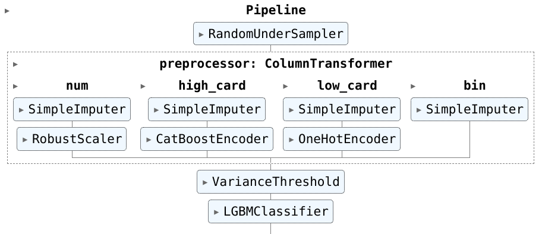

### TinyRecSys23

A lightweight model that can competitively solve the [Recommender Systems Challenge 2023](http://www.recsyschallenge.com/2023/).

Beats top 25 academic models in 300 easy-to-read lines of code, on any old laptop. No GPU needed!

## Architecture

